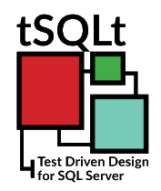

# 🧪 tSQLt - Framework de Tests Unitaires pour SQL Server

## Description

Ce projet illustre l'intégration de [tSQLt](https://tsqlt.org/) dans un environnement SQL Server afin de **mettre en œuvre une stratégie de tests unitaires robustes** pour les procédures stockées, les fonctions et les vues. Il s'agit d'un **exemple structuré de projet de tests unitaires** en T-SQL, adapté aux pratiques DevOps et CI/CD.

---



---

## 🎯 Objectifs

* Démontrer l’utilisation de **tSQLt pour améliorer la qualité du code SQL**
* Structurer des tests unitaires lisibles, isolés et automatisables
* Favoriser l’intégration continue (CI) des bases de données SQL Server
* Permettre la **refactorisation du code T-SQL en toute confiance**

## 📁 Structure du projet

```bash
/tsqlt-project/
├── Database/
│   ├── Scripts/           # Scripts de création de base et de schémas
│   ├── Procedures/        # Procédures stockées métier
│   └── Functions/         # Fonctions utilisées dans l'application
├── Tests/
│   ├── TestCases/         # Cas de test unitaires organisés par module
│   └── Setup/             # Données de test et mocks
├── tsqlt/                 # Framework tSQLt (fichiers nécessaires à l'installation)
├── CI/                    # Pipelines de test automatisés (ex: GitHub Actions, Azure DevOps)
└── README.md              # Documentation du projet
```

## 🚀 Fonctionnalités clés

* Isolation des tests grâce à l’injection de dépendances avec tSQLt
* Exemples de **tests de procédures stockées** avec vérification d’état et de sortie
* Utilisation de **FakeTables** pour simuler les dépendances
* Intégration avec des outils de CI pour exécuter les tests automatiquement

## 🔧 Prérequis

* SQL Server 2016 ou supérieur
* SSMS ou Azure Data Studio
* Droits admin pour exécuter les scripts d’installation de tSQLt

## 📌 Comment contribuer

1. Forkez le projet
2. Créez votre branche de fonctionnalité (`feature/mon-test`)
3. Commitez vos modifications (`git commit -m 'Ajout de tests unitaires'`)
4. Poussez la branche (`git push origin feature/mon-test`)
5. Créez une pull request
